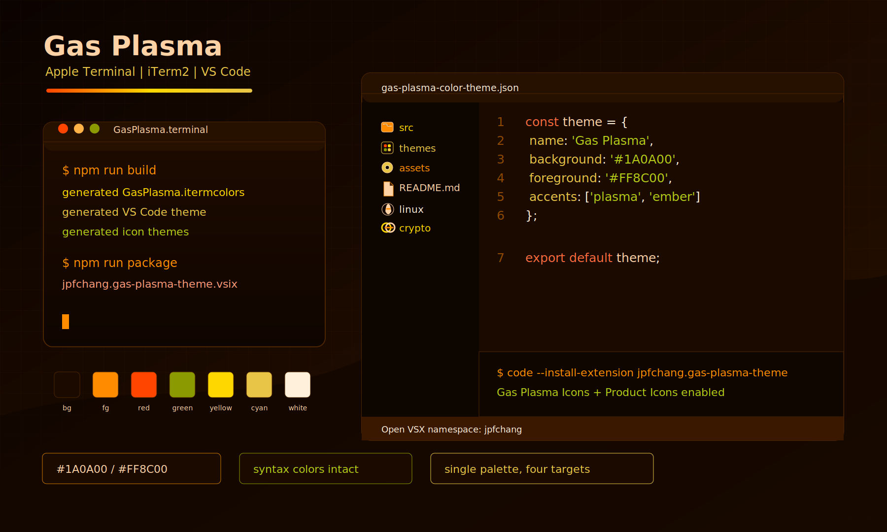
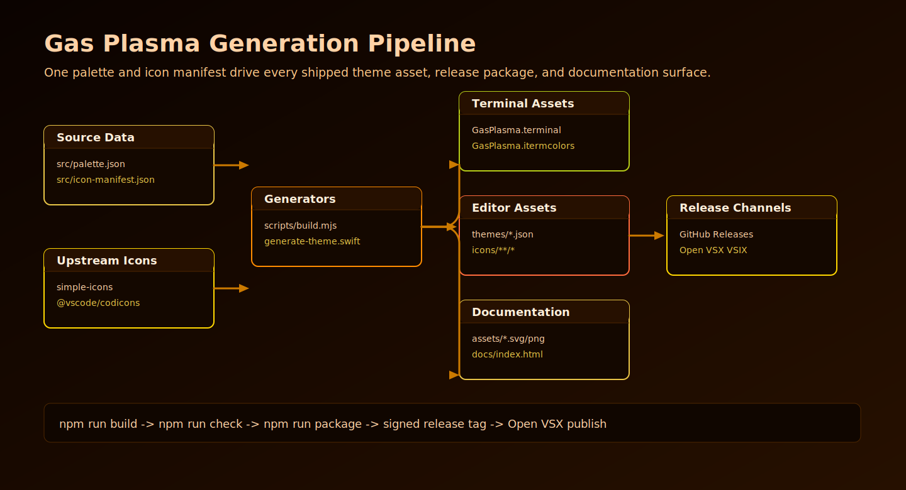

# Gas Plasma

[](https://github.com/JohnThre/GasPlasma-theme/actions/workflows/ci.yml)
[](https://github.com/JohnThre/GasPlasma-theme/actions/workflows/pages.yml)
[](https://open-vsx.org/extension/jpfchang/gas-plasma-theme)

Gas Plasma is an orange-dominant dark theme for Apple Terminal, iTerm2, VS Code, and Open VSX-compatible editors.

The project ships one shared palette across terminal profiles, a VS Code color theme, a VS Code file icon theme, a VS Code product icon theme, a generated logo, and a generated documentation site.



## Contents

- [Install](#install)
- [Theme Package](#theme-package)
- [Architecture](#architecture)
- [Development](#development)
- [Release](#release)
- [Attribution](#attribution)
- [Donation](#donation)

## Install

### Apple Terminal

1. Download `GasPlasma.terminal` from this repository or the latest GitHub Release.
2. Open the file to import the profile into Terminal.
3. Set "Gas Plasma" as the default profile from **Terminal > Settings > Profiles** if desired.

Manual import: **Terminal > Settings > Profiles > ... > Import...** and select `GasPlasma.terminal`.

### iTerm2

1. Download `GasPlasma.itermcolors` from this repository or the latest GitHub Release.
2. Open **iTerm2 > Settings > Profiles > Colors**.
3. Choose **Color Presets... > Import...** and select `GasPlasma.itermcolors`.
4. Select `GasPlasma` from **Color Presets...**.

### VS Code and Open VSX

Install the published extension:

```bash
code --install-extension jpfchang.gas-plasma-theme
```

Or install a local VSIX from a GitHub Release:

```bash
code --install-extension jpfchang.gas-plasma-theme-0.1.0.vsix
```

Extension id: `jpfchang.gas-plasma-theme`

After installation, enable the companion icon themes from the command palette:

- **Preferences: File Icon Theme** > `Gas Plasma Icons`
- **Preferences: Product Icon Theme** > `Gas Plasma Product Icons`

## Theme Package

| Asset | Purpose | Source |
|---|---|---|
| `GasPlasma.terminal` | Apple Terminal profile | `generate-theme.swift`, `src/palette.json` |
| `GasPlasma.itermcolors` | iTerm2 color preset | `scripts/build.mjs`, `src/palette.json` |
| `themes/gas-plasma-color-theme.json` | VS Code color theme | `scripts/build.mjs`, `src/palette.json` |
| `icons/file/gas-plasma-icon-theme.json` | VS Code file icon theme | `scripts/build.mjs`, `src/icon-manifest.json` |
| `icons/product/gas-plasma-product-icon-theme.json` | VS Code product icon theme | `scripts/build.mjs`, `@vscode/codicons` |
| `assets/logo.*`, `assets/mockup.*`, `docs/index.html` | Brand and documentation assets | `scripts/build.mjs` |

File icons use recognizable upstream language and ecosystem logo geometry where available, with restrained Gas Plasma color treatment for contrast. Product icons are generated from VS Code Codicons to preserve the original editor UI icon language.

Language coverage includes C, C++, Objective-C, Pascal, Python, Vala, C#, Java, PHP, Go, Swift, JavaScript, TypeScript, HTML, CSS, Rust, Ruby, Dart, Kotlin, Scala, Lua, R, Zig, Perl, Haskell, Elixir, Erlang, Clojure, F#, SQL, Vue, Svelte, PowerShell, Terraform/HCL, Nix, Julia, Fortran, Ada, COBOL, assembly, Groovy, Crystal, Nim, OCaml, Reason, Elm, MATLAB, VB, Verilog/VHDL, LaTeX, GraphQL, WASM, Astro, Pug, Handlebars, and EJS.

## Architecture

The repository is organized so generated files can be reproduced from source data and scripts.



The generated site lives in `docs/` for GitHub Pages. The extension package intentionally excludes build sources, docs sources, local editor metadata, and AI-assistant local state through `.vscodeignore`.

## Development

Requirements:

- macOS 26.4 or later for Apple Terminal profile generation.
- Node.js 22 or later for extension packaging and generated assets.
- Swift 6 or later with Xcode command-line tools for `GasPlasma.terminal`.

Install dependencies and rebuild every generated asset:

```bash
npm ci
npm run build
npm run check
```

Create a local VSIX package:

```bash
npm run package
```

Primary source files:

- `src/palette.json` controls shared colors.
- `src/icon-manifest.json` controls file, folder, language, and product icon mappings.
- `scripts/build.mjs` generates iTerm2, VS Code, icon, logo, mockup, architecture, and GitHub Pages assets.
- `generate-theme.swift` generates the Apple Terminal profile because Terminal stores colors as archived AppKit color data.
- `scripts/check.mjs` validates generated assets and release packaging assumptions.

## Release

Releases are designed to start from signed `v*` tags. The release workflow verifies the tag signature, builds artifacts, signs `SHA256SUMS` with GPG key `FEA322F2C85C0E17`, creates a GitHub Release, and publishes the VSIX to Open VSX.

Required repository secrets:

- `GPG_PRIVATE_KEY`
- `GPG_PASSPHRASE`
- `OVSX_PAT`

Open VSX namespace: `jpfchang`

If the namespace does not exist when the release workflow runs, the workflow attempts to create it with `ovsx create-namespace`. For verified namespace ownership, follow the Open VSX namespace access guide:

https://github.com/eclipse-openvsx/openvsx/wiki/Namespace-Access

## Attribution

- File icon source geometry uses [Simple Icons](https://simpleicons.org/) where available. Simple Icons is licensed under CC0-1.0.
- Product icon source geometry uses [VS Code Codicons](https://github.com/microsoft/vscode-codicons), licensed under CC-BY-4.0.
- Gas Plasma generated artwork, theme files, and repository code are licensed under GPL-3.0-or-later.

## Security

Report vulnerabilities through GitHub Security Advisories when available. See [SECURITY.md](SECURITY.md).

## Donation

<a href="https://nowpayments.io/donation?api_key=5792a927-dd7d-4b0c-982b-584a7499ffc9" target="_blank" rel="noreferrer noopener">
    
</a>

<a href="https://nowpayments.io/donation?api_key=5792a927-dd7d-4b0c-982b-584a7499ffc9" target="_blank" rel="noreferrer noopener">
    
</a>

## License

[GNU General Public License v3.0](LICENSE)
