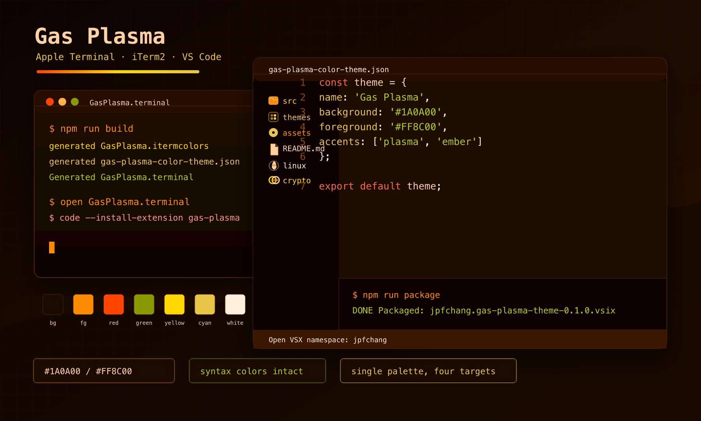

# Gas Plasma

Gas Plasma is an orange-dominant dark theme for VS Code and Open VSX-compatible editors.

It ships a VS Code color theme, a file icon theme, and a product icon theme generated from one shared palette and icon manifest.



## Install

```bash
code --install-extension jpfchang.gas-plasma-theme
```

Or install the VSIX from a GitHub Release:

```bash
code --install-extension jpfchang.gas-plasma-theme-0.1.0.vsix
```

## Included Themes

- `Gas Plasma`
- `Gas Plasma Icons`
- `Gas Plasma Product Icons`

Enable the icon themes from the command palette:

- `Preferences: File Icon Theme` > `Gas Plasma Icons`
- `Preferences: Product Icon Theme` > `Gas Plasma Product Icons`

## Icon System

File icons are generated from recognizable upstream language and ecosystem logo geometry where available, with restrained Gas Plasma color treatment for contrast. Product icons are generated from VS Code Codicons so the editor UI keeps the original VS Code visual language.

Language coverage includes C, C++, Objective-C, Pascal, Python, Vala, C#, Java, PHP, Go, Swift, JavaScript, TypeScript, HTML, CSS, Rust, Ruby, Dart, Kotlin, Scala, Lua, R, Zig, Perl, Haskell, Elixir, Erlang, Clojure, F#, SQL, Vue, Svelte, PowerShell, Terraform/HCL, Nix, Julia, Fortran, Ada, COBOL, assembly, Groovy, Crystal, Nim, OCaml, Reason, Elm, MATLAB, VB, Verilog/VHDL, LaTeX, GraphQL, WASM, Astro, Pug, Handlebars, and EJS.

## Related Files

The repository release also includes matching terminal profiles:

- `GasPlasma.terminal`
- `GasPlasma.itermcolors`

## Attribution

- File icon source geometry uses Simple Icons where available. Simple Icons is licensed under CC0-1.0.
- Product icon source geometry uses VS Code Codicons, licensed under CC-BY-4.0.

## Support

Crypto donations are available through NOWPayments:

https://nowpayments.io/donation?api_key=5792a927-dd7d-4b0c-982b-584a7499ffc9

## License

GPL-3.0-or-later
